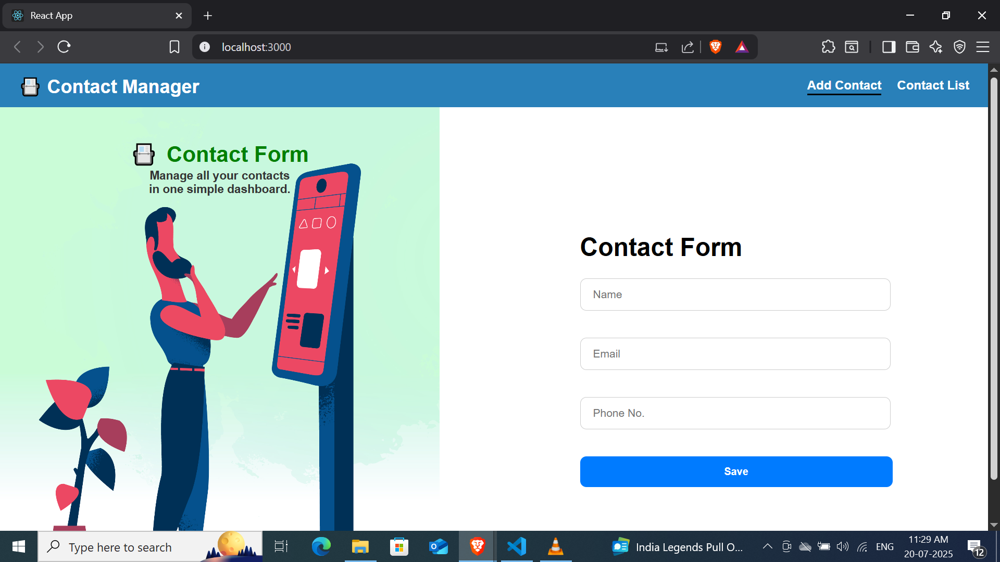

# 📇 Contact Manager App – Day 21 of #100DaysOfReact

Welcome to Day 21 of my #100DaysOfReact journey!  
Today I completed the **Frontend** of a fully functional Contact Manager App. Built with **React**, it allows users to:

### ✅ Features
- 📥 Add a new contact (with name, email, and phone number)
- 🔍 Search and filter contacts by name or email
- 🔃 Sort contacts alphabetically
- 🗑️ Delete contacts
- 📷 Contact image section with styled layout
- ✅ Form validation using Regular Expressions

### 📁 Tech Stack
- **React**
- **CSS Modules**
- **useState Hook**
- **Regex-based validation**

---

### 📸 Preview

---

### 
🔧 Installation
git clone https://github.com/Gauravg2630/React-contact-manager-app.git
cd React-contact-manager-app
npm install
npm start

📅 What's Next?
From tomorrow (Day 22), I’ll start building the backend for this app using Node.js & Express. I’ll add:

SQL database
REST API routes
Backend validation
Full CRUD integration

🚀 Stay Connected
Follow my journey on LinkedIn
Star ⭐ the repo if you like it!